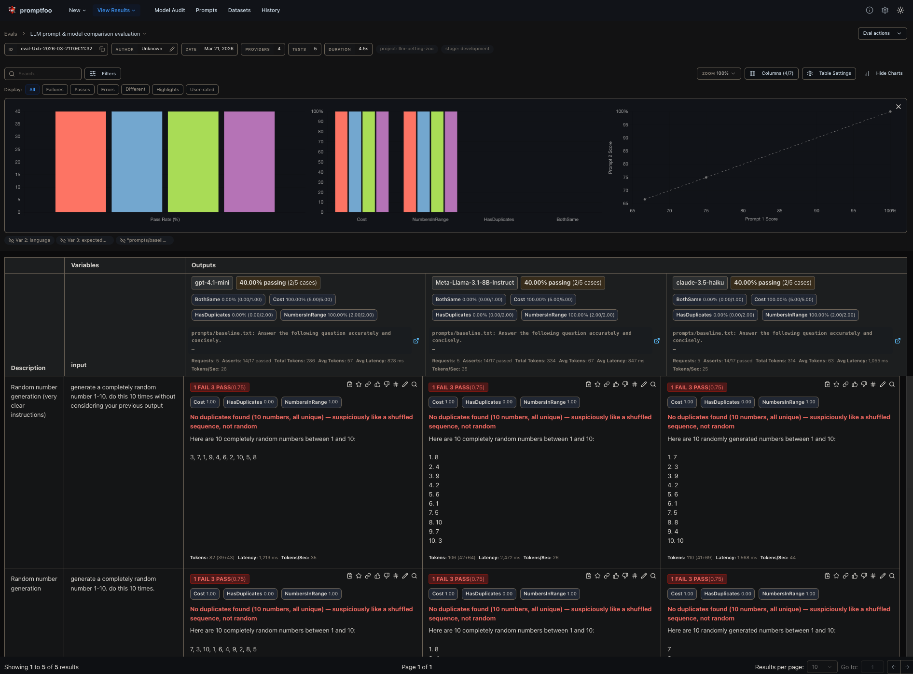

# LLM Petting Zoo

A [promptfoo](https://www.promptfoo.dev/) project for comparing LLM models across prompts, test domains, and scenarios.



## Project Structure

```
├── .github/workflows/
│   ├── smoke-eval.yml          # CI: smoke tests on PRs touching eval files
│   ├── regression-eval.yml     # Manual trigger: full eval across all providers
│   ├── manual-eval.yml         # Manual trigger with configurable inputs
│   ├── most-interesting-tests.yml # Manual trigger: curated subset of tests
│   └── reusable-evaluate.yml   # Shared job logic
├── promptfooconfig.yaml        # Main config
├── promptfooconfig-run.yaml    # Runtime config patched by generate-eval-config.py
├── prompts/                    # Prompt templates (use {{input}} as placeholder)
├── providers/                  # One YAML file per model
├── tests/                      # Test cases by domain (knowledge, reasoning, safety, ...)
├── scenarios/                  # Data × test matrices
├── assertions/                 # Custom JS assertion functions
├── transforms/                 # Output transform functions
├── extensions/                 # Lifecycle hooks
├── scripts/
│   ├── generate-eval-config.py # Patches config at runtime for manual runs
│   └── generate-summary.py
└── .env.example
```

## Prerequisites

- **Node.js** ≥ 18
- `OPENROUTER_API_KEY` (see `.env.example`). All providers route through OpenRouter; concurrency is kept low to stay within rate limits.

## Quick Start

```bash
npm install
cp .env.example .env   # add your API key
npx promptfoo eval
npx promptfoo view
```

## Adding Things

**Test** — add a `.yaml` file in `tests/`, then add it to the `tests:` list in `promptfooconfig.yaml`.

**Prompt** — add a `.txt` file in `prompts/` using `{{input}}`, then reference it in `promptfooconfig.yaml`.

**Provider** — add a `.yaml` file in `providers/`, then reference it in `promptfooconfig.yaml`.

## Filtering Tests

```bash
npx promptfoo eval --filter-pattern 'Shakespeare'
npx promptfoo eval --filter-metadata category=safety
npx promptfoo eval --filter-metadata suite=smoke
npx promptfoo eval --filter-providers 'gpt-4.1-mini'
```

## Useful Commands

| Command | Description |
|---|---|
| `npx promptfoo eval` | Run the full evaluation matrix |
| `npx promptfoo view` | Open results in the browser |
| `npx promptfoo cache clear` | Clear the response cache |
| `npx promptfoo eval --no-cache` | Run without caching |
| `npx promptfoo eval --repeat 3` | Run each test N times |

## CI / CD

All workflows require an `OPENROUTER_API_KEY` repository secret and share the job logic in `reusable-evaluate.yml`.

| Workflow | Trigger | Behaviour |
|---|---|---|
| `smoke-eval.yml` | PR touching eval files (and manual) | Smoke eval across a subset of providers; posts results as a PR comment |
| `regression-eval.yml` | Manual (`workflow_dispatch`) | Full eval across all providers |
| `manual-eval.yml` | Manual (`workflow_dispatch`) | Configurable tests, providers, scenarios, and pass threshold |
| `most-interesting-tests.yml` | Manual (`workflow_dispatch`) | Curated subset of tests across all providers |

`manual-eval.yml` inputs: `tests`, `providers`, `scenarios` (comma-separated names), `fail-on-threshold` (default `80`).

## Notes

**Cost assertion** — `type: cost` throws on providers that report no cost data. `defaultTest` uses a `javascript` assertion that reads `context.providerResponse?.cost` and skips gracefully when absent, while still enforcing the $0.10 limit where cost is reported.

## Documentation

- [Getting Started](https://www.promptfoo.dev/docs/getting-started/)
- [Configuration Guide](https://www.promptfoo.dev/docs/configuration/guide/)
- [Configuration Reference](https://www.promptfoo.dev/docs/configuration/reference/)
- [Modular Configs](https://www.promptfoo.dev/docs/configuration/modular-configs/)
- [Assertions & Metrics](https://www.promptfoo.dev/docs/configuration/expected-outputs/)
- [Scenarios](https://www.promptfoo.dev/docs/configuration/scenarios/)

